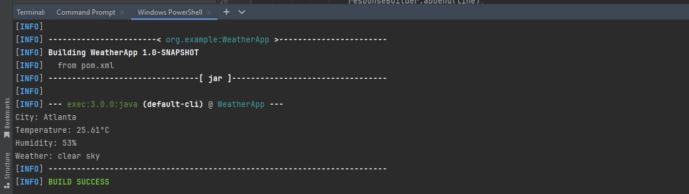

# WeatherApp

WeatherApp is a Java-based command-line application that fetches real-time weather data from the OpenWeatherMap API for a specified city. The application uses Apache HttpClient for HTTP requests and JSON for parsing the response.

## Table of Contents
- [Features](#features)
- [Prerequisites](#prerequisites)
- [Installation](#installation)
- [Usage](#usage)
- [Sample](#Output)
- [Technologies](#technologies)
- [Contributing](#contributing)

## Features
- Fetches current weather details such as temperature, humidity, and weather description
- Simple command-line interface for easy use
- Customizable to fetch weather data for any city

## Prerequisites
- Java JDK 8 or higher
- Apache Maven
- OpenWeatherMap API key

## Installation

1. Clone the repository:
   ```bash
   git clone https://github.com/nirajktr/WeatherApp.git
   ```

2. Navigate to the project directory:
   ```bash
   cd WeatherApp
   ```

3. Set up your OpenWeatherMap API key:
   - Create an account at [OpenWeatherMap](https://openweathermap.org/)
   - Retrieve your API key
   - Replace the `apiKey` value in `src/main/java/org/example/WeatherApp.java` with your OpenWeatherMap API key

4. Build the project using Maven:
   ```bash
   mvn clean install
   ```

## Usage

1. Open the `src/main/java/org/example/WeatherApp.java` file in your preferred text editor.

2. Locate the `stringCity` variable in the `main` method and change its value to the city for which you want to fetch weather data. For example:
   ```java
   String stringCity = "London";
   ```

3. Save the file after making your changes.

4. Run the application:
   ```bash
   mvn exec:java -Dexec.mainClass="org.example.WeatherApp"
   ```

5. The application will display the current weather information for the specified city.

Note: You need to manually change the `stringCity` value in the source code and recompile the application each time you want to check the weather for a different city.

## Sample Output
Here is an output when ```stringCity = "Atlanta"```


## Technologies
- Java
- Apache Maven
- Apache HttpClient
- JSON Library

## Contributing

Contributions are welcome! Please follow these steps to contribute:

1. Fork the repository
2. Create a new branch: `git checkout -b feature-name`
3. Make your changes and commit them: `git commit -m "Add feature"`
4. Push to the branch: `git push origin feature-name`
5. Open a pull request on GitHub

## License

[MIT](https://choosealicense.com/licenses/mit/)
